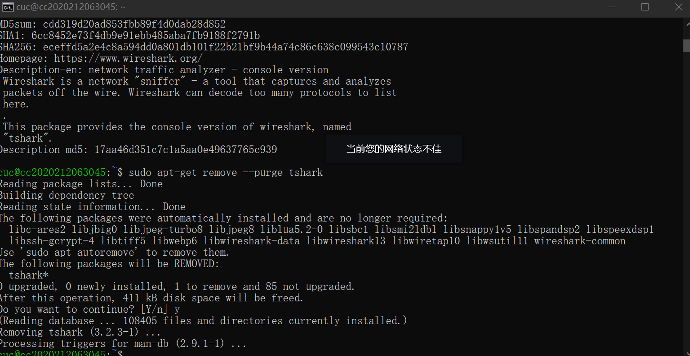

# 实验二

------

## 实验环境

- **当前课程推荐的 Linux 发行版本**
- **本地环境（Ubuntu20.04.2)**
- **云环境（CentOS）**
- **在asciinema注册一个账号，并在本地安装配置好asciinema**
  
------

## 安装asciinema
```shell
sudo apt-add-repository ppa:zanchey/asciinema
sudo apt-get update
sudo apt-get install asciinema
```


## 关联asciinema账号
```shell
asciinema auth
```

### 然后在已登录的界面输入https://asciinema.org/connect/fec0aa7a-a97e-4f29-b677-04c6851c1346即可查看自己录制的命令行视频


------

## 实验问题
- **使用表格方式记录至少 2 个不同 Linux 发行版本上以下信息的获取方法，使用 asciinema 录屏方式「分段」记录相关信息的获取过程和结果**
#### Lesson1 查看Linux内核版本命令（2种方法）： 
#### 1.1 cat /proc/version
[](https://asciinema.org/a/SCz16JQkcgzth8CDbaVHIdZky)
#### 1.2 uname -a
[](https://asciinema.org/a/S3YcDeEGD3ShvVzlaiZqRyakg)

#### Lesson2 查看Linux系统版本的命令（3种方法）：
#### 2.1 lsb_release -a，即可列出所有版本信息
[](https://asciinema.org/a/97VBAQ5JLkHF7EfVpJR9ugQv6)
#### 2.2  cat /etc/redhat-release，这种方法只适合Redhat系的Linux（我的版本不适用）
[](https://asciinema.org/a/XMLRQSKbTniNcJuwedwlg0Of0)
#### 2.3 cat /etc/issue，此命令也适用于所有的Linux发行版
[](https://asciinema.org/a/SBQVdlo4DXSlajwYBUN3d2ZS2)

------

- **【软件包管理】在目标发行版上安装 tmux 和 tshark ；查看这 2 个软件被安装到哪些路径；卸载 tshark ；验证 tshark 卸载结果**
#### 1、tmux的安装和查看安装路径
```shell
sudo apt install tmux #安装tmux
sudo apt-cache show tmux #查看当前安装路径
```


#### 2、tshark的安装、查看安装路径和卸载
```shell
sudo apt-get install tshark #安装tshark
sudo apt-cache show tshark	#查看当前安装路径
sudo apt-get remove --purge tshark #卸载tshark
```




------

- **【文件管理】复制以下 shell 代码到终端运行，在目标 Linux 发行版系统中构造测试数据集，然后回答以下问题：**
```shell
cd /tmp && for i in $(seq 0 1024);do dir="test-$RANDOM";mkdir "$dir";echo "$RANDOM" > "$dir/$dir-$RANDOM";done
```

### 找到 /tmp 目录及其所有子目录下，文件名包含 666 的所有文件
```shell
sudo find ./ -type f -name "*666*"
```


### 找到 /tmp 目录及其所有子目录下，文件内容包含 666 的所有文件
```shell
sudo grep -r "666" ./
```


------

- **【文件压缩与解压缩】练习课件中 文件压缩与解压缩 一节所有提到的压缩与解压缩命令的使用方法**
```shell
gzip filename #压缩
gzip -d filename #解压
```
```shell
bzip2 -z FileName #压缩
1>.bzip2 -d FileName.bz2   2>.bunzip2 FileName.bz2 #解压
```
```shell
zip FileName.zip DirFileName #压缩
unzip FileName.zip #解压
```

------

- **【跟练】 子进程管理实验**
[](https://asciinema.org/a/Tv214ce6sSYNkP7QyhQKmxPOc)
[](https://asciinema.org/a/Jly9keUBYg9ylX6ao9oaGr7ff)
[](https://asciinema.org/a/E7YPlzAgtddinK4ZzGusDeUux)

------

- **【硬件信息获取】目标系统的 CPU、内存大小、硬盘数量与硬盘容量**
```shell
cat /proc/cpuinfo | grep 'model name' |uniq 或 grep "model name" /proc/cpuinfo |awk -F ':' '{print $NF}' #查看CPU型号
cat /proc/cpuinfo | grep "physical id" | uniq | wc -l #查看CPU个数
cat /proc/cpuinfo | grep "cpu cores" | uniq 或 lscpu |grep "Core(s) per socket" |awk '{print $NF}' #查看每个CPU的核数
```


```shell
cat /proc/meminfo #查看内存容量
free -h #total一栏则是总的内存情况
```


```shell
sudo fdisk -l |grep "Disk /dev/sd"  #查看硬盘数量和大小
```


------

## 遇到的问题及总结
- 1、关于输出定向的命令有疑问，>/dev/null 2>&1 是什么意思？ 于是自行上网搜索了相关资料了解，参考链接：https://www.jianshu.com/p/1a266fcd7bd1
- 2、安装管理包时，在阿里云平台系统中输入和在Ubuntu输入的命令语句有很多不同之处，需要重新查阅了解CentOS的语句文档
- 3、云环境安装tshark时一开始无法安装成功，原因说明是没有该软件包。 解决方法：询问同学后，知道了是因为Centos的tshark软件包是包含在Wireshark中的，所以在该环境下安装Wireshark也能实现要求
- 4、在查找包含特定字符串的文件那里一开始做真的毫无头绪，上网查阅了很多相关的资料，才一步步摸清了语法的规则的，参考资料有：https://www.cnblogs.com/miracle-luna/p/11037614.html
- 5、在【硬件信息获取】那里参考了网上的资料，参考资料：https://blog.csdn.net/JineD/article/details/107611133 和 https://blog.csdn.net/zhizhengguan/article/details/88353166
- 6、改进了markdown的格式书写，增加了代码版块、分隔符、命令语句注释和序列表示