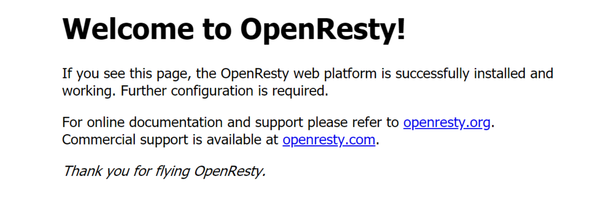
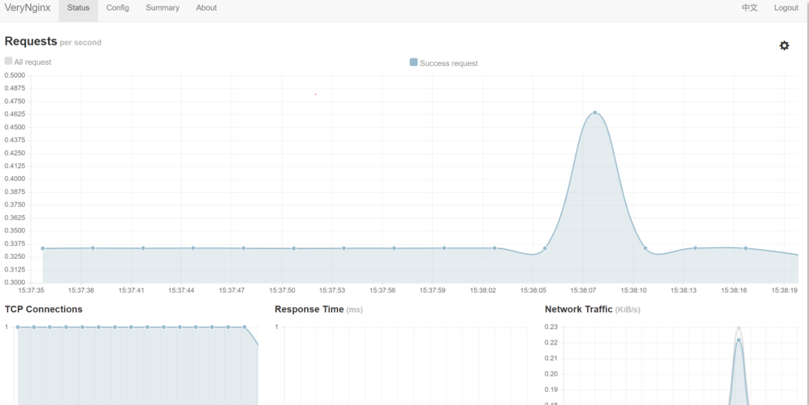
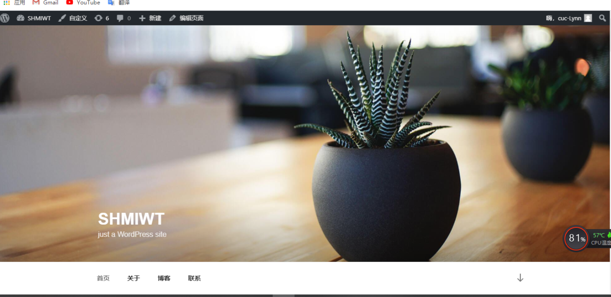
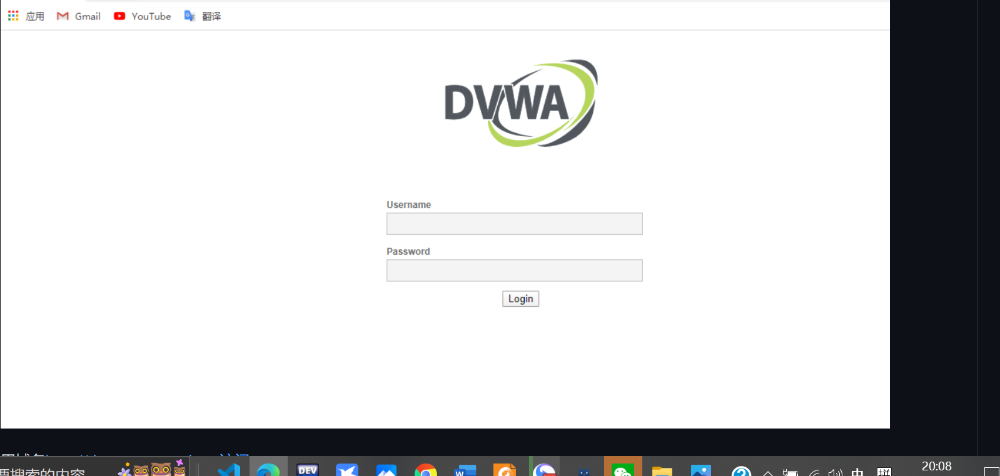
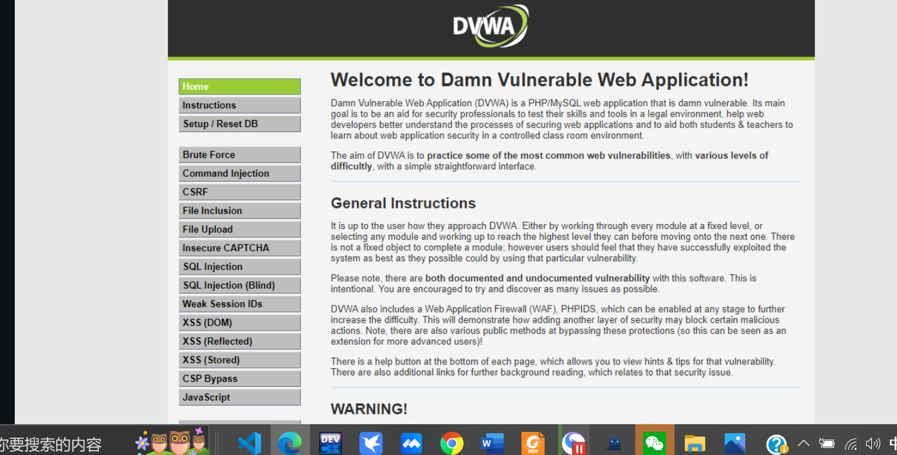
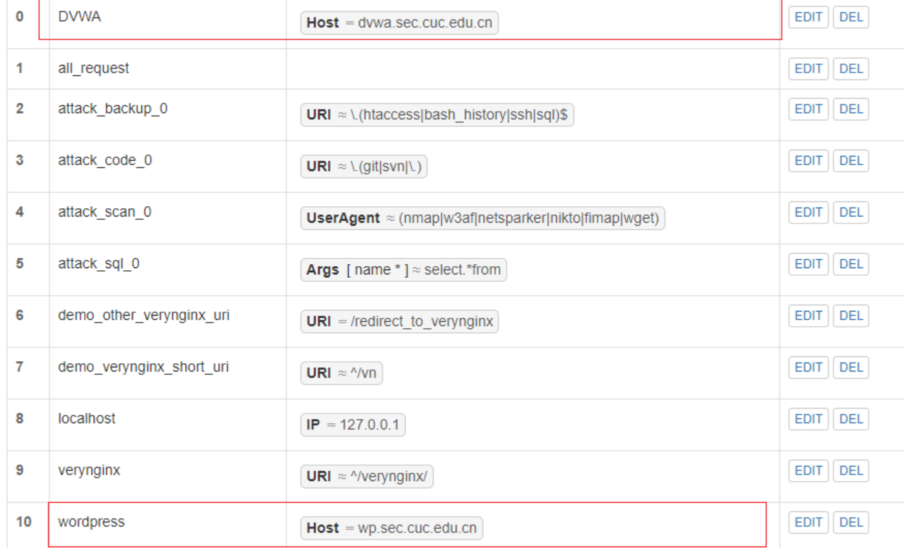
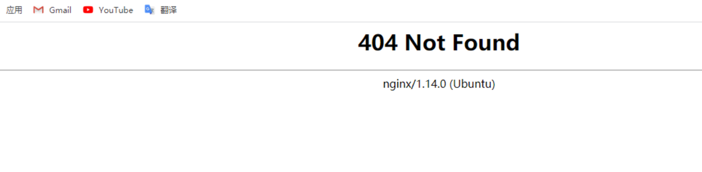
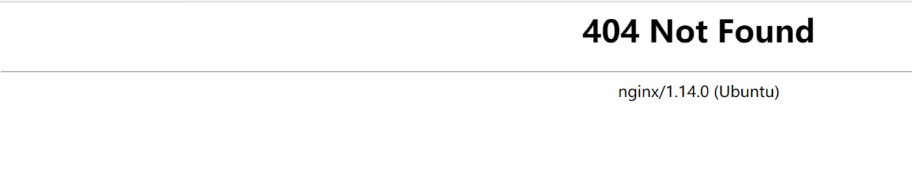
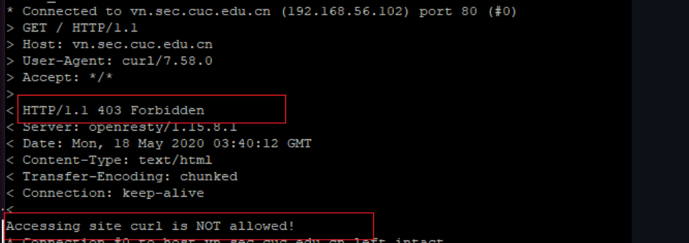

# 第五章：Web服务器（实验）

# 实验环境

- 测试客户端：
  - Windows 10, IP:192.168.56.102
  - Ubuntu 20.04 IP:192.168.56.101
  
- 服务端
  - Ubuntu20.04
  - Nginx
  - VeryNginx
  - Wordpress 4.7
  - DVWA

# 实验问题

基本要求：

  - 在一台主机（虚拟机）上同时配置Nginx和VeryNginx
  -  VeryNginx作为本次实验的Web App的反向代理服务器和WAF
  -  PHP-FPM进程的反向代理配置在nginx服务器上，VeryNginx服务器不直接配置Web站点服务
-  使用Wordpress搭建的站点对外提供访问的地址为： http://wp.sec.cuc.edu.cn
-  使用Damn Vulnerable Web Application (DVWA)搭建的站点对外提供访问的地址为： http://dvwa.sec.cuc.edu.cn


安全加固要求：


  - 使用IP地址方式均无法访问上述任意站点，并向访客展示自定义的友好错误提示信息页面-1
-  Damn Vulnerable Web Application (DVWA)只允许白名单上的访客来源IP，其他来源的IP访问均向访客展示自定义的友好错误提示信息页面-2
-  在不升级Wordpress版本的情况下，通过定制VeryNginx的访问控制策略规则，热修复WordPress < 4.7.1 - Username Enumeration
-  通过配置VeryNginx的Filter规则实现对Damn Vulnerable Web Application (DVWA)的SQL注入实验在低安全等级条件下进行防护

VeryNginx配置要求


-  VeryNginx的Web管理页面仅允许白名单上的访客来源IP，其他来源的IP访问均向访客展示自定义的友好错误提示信息页面-3
-  通过定制VeryNginx的访问控制策略规则实现：
  -  限制DVWA站点的单IP访问速率为每秒请求数 < 50
  -  限制Wordpress站点的单IP访问速率为每秒请求数 < 20
  -  超过访问频率限制的请求直接返回自定义错误提示信息页面-4
  -  禁止curl访问


# 实验过程
## 基本要求
### 更改Windows主机和虚拟机hosts文件
```bash
    # web Server
    192.168.56.101 vn.sec.cuc.edu.cn
    192.168.56.101 dvwa.sec.cuc.edu.cn
    192.168.56.101 wp.sec.cuc.edu.cn
```


### 安装配置Nginx、Verynginx、Wordpress、DVWA

  #### Nginx
   
  - ```bash
    sudo apt install nginx
    ```
- 安装mysql数据库和安全脚本
  ```bash
  sudo apt install mysql-server
  sudo mysql_secure_installation
  ```
- 安装php
  ```bash
  sudo apt install php-fpm php-mysql
  ```
- 如下图，此时发现在主机访问80端口可以访问Nginx初始页面
  
  
- 修改Nginx配置
    ```bash
    sudo vim /etc/nginx/sites-available/default 
    listen 8080 default_server;
    listen [::]:8080 default_server;
    sudo nginx -s reload  
    ```
- 在主机访问8080端口，输入：`http://192.168.56.101:8080`,发现可以访问Nginx初始页面。如下图:
  

- PHP-FPM进程的反向代理
  - 安装php扩展
    ```bash
    sudo apt update
    sudo apt install php-curl php-gd php-intl php-mbstring php-soap php-xml php-xmlrpc php-zip

    sudo systemctl restart php7.2-fpm
    ```
  - 配置PHP-FPM进程的反向代理在Nginx服务器上
    ```bash
    # 修改nginx配置文件
    sudo vim /etc/nginx/sites-enabled/default
    
    location ~ \.php$ {
              include snippets/fastcgi-php.conf;
              fastcgi_pass unix:/var/run/php/php7.2-fpm.sock;
          }
          location ~ /\.ht {
              deny all;
          }
      }
    ```


#### Verynginx
- ```bash
    # 安装一些库和依赖
    sudo apt-get install libpcre3-dev libssl1.0-dev zlib1g-dev build-essential
    # 克隆VeryNginx仓库
    git clone https://github.com/alexazhou/VeryNginx.git 
    # 进入仓库目录
    cd VeryNginx
    # 根据第一次安装时的报错，提前安装好需要的依赖
    sudo apt-get install zlib1g-dev
    sudo apt-get install libpcre3 libpcre3-dev
    sudo apt install gcc
    sudo apt install make
    sudo apt install libssl-dev
    # 注意python3
    sudo python3 install.py install
    # 修改 `/opt/verynginx/openresty/nginx/conf/nginx.conf` 配置文件
    sudo vim /opt/verynginx/openresty/nginx/conf/nginx.conf
    # 将user nginx改成user www-data

    # 添加Nginx进程权限
    chmod -R 777 /opt/verynginx/verynginx/configs
  
    sudo /opt/verynginx/openresty/nginx/sbin/nginx
  ```

- 然后在主机输入`http://192.168.56.101:80/verynginx/index.html`, 进入登录面以用户名：`verynginx` 密码：`verynginx`登入,进行相关配置。如下图：


#### Wordpress
- 首先下载wordpress4.7安装包
  ```bash
    # 下载安装包
    sudo wget https://wordpress.org/wordpress-4.7.zip
    # 下载解压软件
    sudo apt install p7zip-full
    # 解压
    7z x wordpress-4.7.zip
    # 将解压后的wordpress移到指定路径
    sudo mkdir /var/www/html/wp.sec.cuc.edu.cn
    sudo cp -r wordpress /var/www/html/wp.sec.cuc.edu.cn
    ```

- 然后在MySql中新建一个数据库用于数据管理
    ```bash
    # 安装mysql
    sudo apt install mysql-server
    # 运行mysql
    sudo mysql
    # 新建数据库wordpress
    CREATE DATABASE wordpress DEFAULT CHARACTER SET utf8 COLLATE utf8_unicode_ci;
    # 新建用户，授权，最后刷新并退出
    create user 'cyxw'@'localhost' identified by 'cuc';
    grant all on wordpress.* to 'cyxw'@'localhost';
    flush privileges;
    exit;
    ```

-  配置WordPress
```bash
  # 修改nginx配置 
  sudo vim /etc/nginx/sites-enabled/default
  
  # 将网站根站点修改为wordpress的安装目录 并保存退出
  root /var/www/html/wp.sec.cuc.edu.cn;

  使用`wp.sec.cuc.edu.cn/wordpress/wp-admin/`访问wordpress进行配置，选择语言，然后连接数据库，设置完wordpress用户名密码即可访问wordpress网站。
  ```
  如图成功访问WordPress
  


#### DVWA
- 下载安装
    ```bash
    # 将DVWA源码克隆到本地DVWA
    sudo git clone https://github.com/digininja/DVWA.git
    # 建立文件存放的目录
    sudo mkdir /var/www/html/dvwa.sec.cuc.edu.cn
    # 把下载好的DVWA移到刚刚创建的目录下
    sudo mv DVWA/* /var/www/html/dvwa.sec.cuc.edu.cn
    # 修改文件夹属主为 www-data
    sudo chown -R www-data:www-data /var/www/html/dvwa.sec.cuc.edu.cn
    ```
- MySQL操作
    ```bash
    # 启动MySQL
    sudo mysql
    # 建立dvwa的数据库和用户
    create database dvwa;
    create user dvwa@localhost identified by 'p@ssw0rd';
    grant all on dvwa.* to dvwa@localhost;
    flush privileges;
    exit;
    ```
- 设置DVWA与PHP等相关环境
    ```bash
    # 重命名
    cd /var/www/html/dvwa.sec.cuc.edu.cn/config/
    sudo cp config.inc.php.dist config.inc.php
    # 修改配置
    sudo vim /var/www/html/DVWA/config/config.inc.php
    ## 根据数据库对应修改配置
    $_DVWA[ 'db_database' ] = 'dvwa';
    $_DVWA[ 'db_user' ]     = 'dvwauser';
    $_DVWA[ 'db_password' ] = 'p@ssw0rd';
    ##
    # 修改php配置
    sudo vim /etc/php/7.2/fpm/php.ini 
    
    ## 设置以下内容
    allow_url_include = on
    allow_url_fopen = on
    safe_mode = off
    magic_quotes_gpc = off
    display_errors = off
    ##
    #重启php
    sudo systemctl restart php7.2-fpm
    #将所有权分配给www-data用户和组
    sudo chown -R www-data.www-data /var/www/html/dvwa.sec.cuc.edu.cn
    ```
 
- 创建新服务器块配置文件
    ```bash
    sudo vim /etc/nginx/sites-available/dvwa.sec.cuc.edu.cn
    ```
- 写入：
    ```bash
    server {
        listen 8080 default_server;
        listen [::]:8080 default_server;
        root /var/www/html/dvwa.sec.cuc.edu.cn;
        index index.php index.html index.htm index.nginx-debian.html;
        server_name dvwa.sec.cuc.edu.cn;
        location / {
            #try_files $uri $uri/ =404;
            try_files $uri $uri/ /index.php$is_args$args;  
        }
  
        location ~ \.php$ {
            include snippets/fastcgi-php.conf;
            fastcgi_pass unix:/var/run/php/php7.2-fpm.sock;
        }
        location ~ /\.ht {
            deny all;
        }
    }
    ```
    
- 创建从新服务器块配置文件到/etc/nginx/sites-enabled/目录的符号链接
    ```bash
    sudo ln -s /etc/nginx/sites-available/dvwa.sec.cuc.edu.cn /etc/nginx/sites-enabled/
    ```

- 测试并重启Nginx服务
    ```bash
    sudo nginx -t
    sudo systemctl reload nginx
    ```
- 如图，成功访问DVWA


- 通过8080端口访问`dvwa.sec.cuc.edu.cn`

    在登录页面输入默认账号密码：
    ```
    User: admin
    Password: password
    ```
- 结果如图
  

### 在以上安装配置完成基础之上实现以下要求
- VeryNginx作为本次实验的Web App的反向代理服务器和WAF
  -如下图，添加matcher，添加Up Stream以及添加代理通行证Proxy Pass
  
  


#### 安全加固要求
- 使用IP地址方式均无法访问上述任意站点，并向访客展示自定义的**友好错误提示信息页面-1**

  - 添加matcher

    

  - 添加自定义response

    

  - 添加filter

    

  - 结果:
 
    

- [Damn Vulnerable Web Application (DVWA)](http://www.dvwa.co.uk/)只允许白名单上的访客来源IP，其他来源的IP访问均向访客展示自定义的**友好错误提示信息页面-2**

  - 添加matcher

    

  - 添加自定义response

    

  - 添加filter

    

  - 之前的页面变为下图
 
    

- 在不升级Wordpress版本的情况下，通过定制[VeryNginx](https://github.com/alexazhou/VeryNginx)的访问控制策略规则，热修复WordPress < 4.7.1 - Username Enumeration

  - 添加matcher

    

  - 添加filter

    

  - 结果
    
    

- 通过配置[VeryNginx](https://github.com/alexazhou/VeryNginx)的Filter规则实现对[Damn Vulnerable Web Application (DVWA)](http://www.dvwa.co.uk/)的SQL注入实验在低安全等级条件下进行防护

  - 添加matcher

    


  - 添加filter

    

  - 结果
    

#### VeryNginx配置要求
- [VeryNginx](https://github.com/alexazhou/VeryNginx)的Web管理页面仅允许白名单上的访客来源IP，其他来源的IP访问均向访客展示自定义的**友好错误提示信息页面-3**
  - 添加matcher

    

  - 添加自定义response

    

  - 添加filter

    

  - 结果:

    


- 通过定制VeryNginx的访问控制策略规则实现：

  - 限制DVWA站点的单IP访问速率为每秒请求数 < 50
  - 限制Wordpress站点的单IP访问速率为每秒请求数 < 20
  - 超过访问频率限制的请求直接返回自定义**错误提示信息页面-4**

    - 添加自定义response

      

    - 添加频率限制Frequency Limit

      

    - 结果 
      
      
  - 禁止curl访问
  
    - 添加matcher
  
      
  
    - 添加filter
      

    - 结果
       


# 遇到的问题和解决方法
- 问题：一开始打不开网站
  解决方法：要在hosts文件里面加入ip地址
  
- 问题：下载时Git clone速度太慢
  解决方法：参考资料[git clone速度太慢的解决办法](https://www.linuxidc.com/Linux/2019-05/158461.htm)

- 问题：按操作说明配置完WordPress后无法打开默认配置页面
  解决办法：
    修正端口冲突
    nginx: 8080
    verynginx: 8005
    wp.sec.cuc.edu.cn: 8001（试访问时加端口）
    dvwa.sec.cuc.edu.cn: 8006（试访问时加端口）

# 参考资料
- [alexazhou/VeryNginx官方文档](https://github.com/alexazhou/VeryNginx/blob/master/readme_zh.md)
- [How To Install Linux, Nginx, MySQL, PHP (LEMP stack) on Ubuntu 18.04](https://www.digitalocean.com/community/tutorials/how-to-install-linux-nginx-mysql-php-lemp-stack-ubuntu-18-04)
- [How To Install WordPress with LEMP on Ubuntu 18.04](https://www.digitalocean.com/community/tutorials/how-to-install-wordpress-with-lemp-on-ubuntu-18-04)
- [How to Install and Configure DVWA Lab on Ubuntu 18.04 server](https://kifarunix.com/how-to-setup-damn-vulnerable-web-app-lab-on-ubuntu-18-04-server/)
- [linux-2021-ananan](https://github.com/CUCCS/2021-linux-public-ananan2001/blob/chap0x05/chap0x05/%E7%AC%AC%E4%BA%94%E6%AC%A1%E5%AE%9E%E9%AA%8C%E6%8A%A5%E5%91%8A.md)